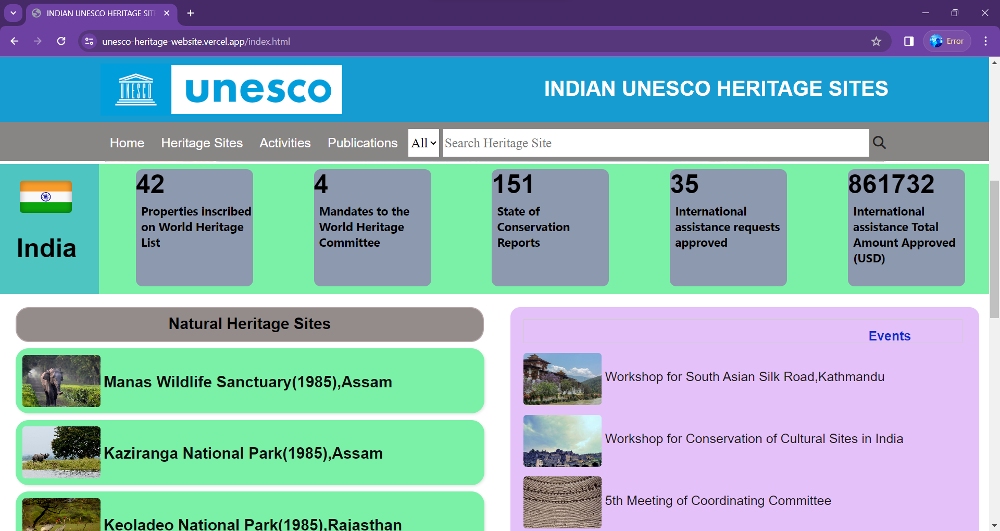
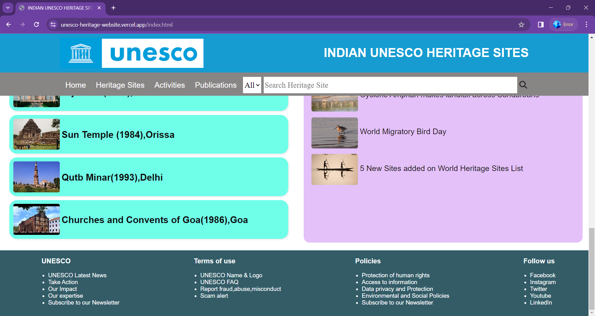
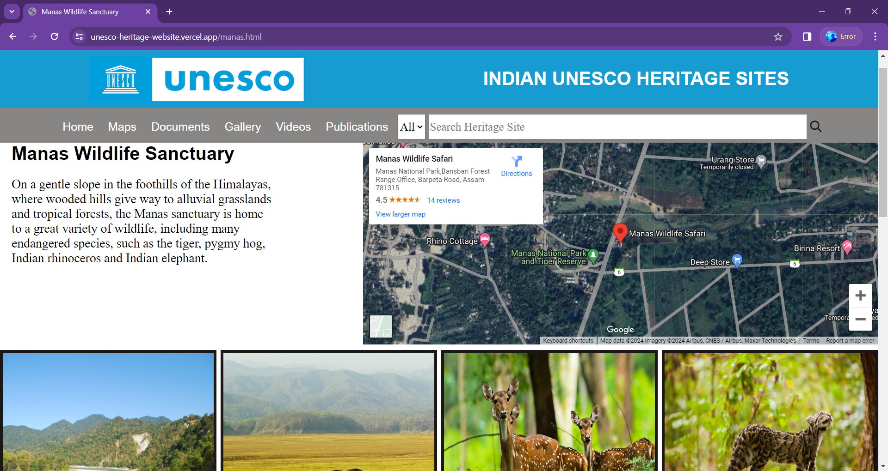

# UNESCO-Heritage-website
<h3>This is a web project on UNESCO Indian Heritage sites.</h3> 
<h3><b>Project Structure</b></h3>

The main source page is index.html with styling given in UNESCO1.css

The html pages for various heritage sites have been attached subsequently
 

<h3><b>Technologies Used</b></h3>
<ul>
  <li>HTML</li>
  <li>CSS</li>
</ul>
<h3><b>Running the Project</b></h3>

You can open the website with the following Link - https://unesco-heritage-website.vercel.app/

<h3><b>Screenshots</b></h3>
<h4>Home Page</h4>

<h4>Heritage Site Page</h4>

(For better experience open the website with 100% window zoom level)

